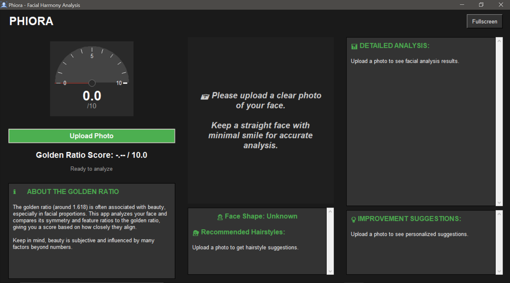
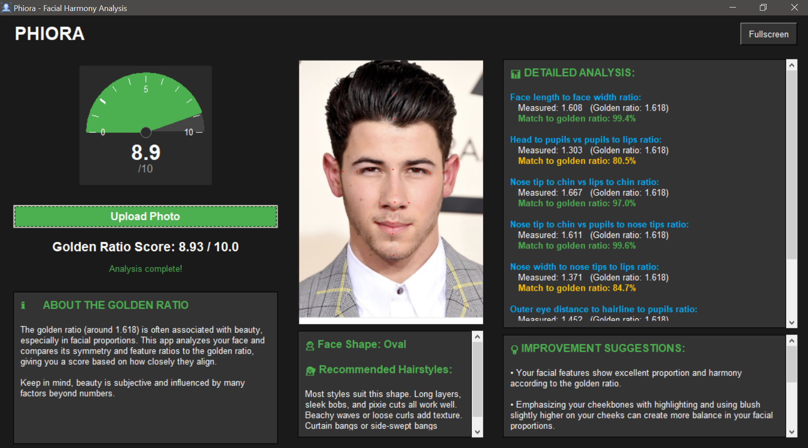

<p align="center">
  
</p>
<h1 align="center">Phiora</h1>
<p align="center"><em>Facial Beauty Analysis Using the Golden Ratio</em></p>

Phiora is a **Python-based facial analysis app** that evaluates facial aesthetics using the **golden ratio**. It detects key facial landmarks with **OpenCV** and neural networks, computes proportional ratios, and provides a **beauty score from 1 to 10**. Beyond scoring, Phiora offers insights like **face shape analysis** and **personalized hairstyle suggestions**, making it useful for **cosmetic science, AR/VR, digital fashion, and educational tools**.

---

<div align="center">

[](https://github.com/Pratham-Vishwakarma/Phiora/releases/latest)
[](https://github.com/Pratham-Vishwakarma/Phiora/stargazers)
[](https://github.com/Pratham-Vishwakarma/Phiora/network/members)
[](https://github.com/Pratham-Vishwakarma/Phiora/blob/main/license.txt)
[](https://github.com/Pratham-Vishwakarma/Phiora/releases/latest)
[](https://github.com/Pratham-Vishwakarma/Phiora/issues)
[](https://github.com/Pratham-Vishwakarma/Phiora)


</div>

---

## Table of Contents

- [Table of Contents](#table-of-contents)
- [Features](#features)
- [Installation / Setup](#installation--setup)
- [Usage](#usage)
  - [General User](#general-user)
  - [Developer](#developer)
- [Screenshots / Demo](#screenshots--demo)
- [Project Structure](#project-structure)
- [Configuration](#configuration)
- [Contributing Guidelines](#contributing-guidelines)
- [Roadmap](#roadmap)
- [Built With / Tech Stack](#built-with--tech-stack)
- [Authors / Acknowledgements](#authors--acknowledgements)
- [License](#license)
- [Support / Contact](#support--contact)

## Features

* 📸 <u>**Image Upload & Facial Detection**</u> – Upload images to automatically detect faces and extract key landmarks.
* 📐 <u>**Golden Ratio Scoring**</u> – Computes proportional ratios and delivers a ***beauty score (1–10)*** based on mathematical foundations of symmetry.
* 🖼 <u>**Landmark Visualization**</u> – Displays processed images with ***highlighted facial landmarks*** for clarity.
* 🧑‍🤝‍🧑 <u>**Face Shape Analysis**</u> – Identifies overall face shape to provide deeper insights into facial structure.
* 💇 <u>**Personalized Enhancements**</u> – Suggests ***hairstyle recommendations*** tailored to individual facial contours.
* 💻 <u>**Intuitive Desktop Interface**</u> – Lightweight and user-friendly GUI built with ***Tkinter***.
* ⚡ <u>**Quick Setup**</u> – Simple installation with minimal dependencies for seamless use.
* 🎯 <u>**Multi-Domain Applications**</u> – Applicable in ***cosmetic science, AR/VR, digital fashion, educational tools, and computational aesthetics research***.

## Installation / Setup

**Prerequisites:**

* Python 3.11 or lower
* OpenCV
* Mediapipe
* Pillow (PIL)
* Tkinter
* Pandas
* Matplotlib

**Steps for Installation:**

```bash
# Clone repository
git clone https://github.com/Pratham-Vishwakarma/Phiora.git
cd Phiora

# Create a .venv
python -m venv .venv

# Activate the .venv
## For macOS/Linux
source .venv/bin/activate
## For Windows (Command Prompt)
.venv\Scripts\activate
## For Windows (PowerShell)
.venv\Scripts\Activate.ps1

# Install dependencies
pip install -r requirements.txt
```

## Usage

### General User

1. Download the [Phiora Setup](https://github.com/Pratham-Vishwakarma/Phiora/releases/download/v1.5.0/Phiora_Setup_v2.0.0.exe).
2. Follow installation instructions.
3. Launch the Phiora application.
4. Click **Upload Image** and select your image.
5. The app detects landmarks, scores facial symmetry, analyzes face shape, suggests hairstyles, and shows results.

### Developer

```bash
python main.py
```

* Click **Upload Image** and select an image.
* Facial landmarks, symmetry score, face shape, and hairstyle suggestions are displayed in-app.

## Screenshots / Demo

<div align="center">
  

</div>  

## Project Structure

```
/src              -> Source code
/src/main.py      -> Entry point of the application
/assets           -> Assets of the projects.
/images           -> Images used for testing the models effeciency
/models           -> Machine learning models used for image landmarking and ratio analysis.
/public           -> Public images used in the app
/requirements.txt -> Dependencies
```

## Configuration

* No mandatory config files required.
* Optional: Add custom parameters in `config.py` for advanced usage.

## Contributing Guidelines

1. Fork the repository.
2. Create a feature branch (`git checkout -b feature-name`).
3. Commit your changes (`git commit -m "Add feature"`).
4. Push to the branch (`git push origin feature-name`).
5. Open a Pull Request.

## Roadmap

* [ ] Add ***real-time webcam scoring***
* [ ] Support ***batch image processing***
* [ ] Improve GUI with ***interactive visualizations***
* [ ] Add ***additional facial scoring metrics***

## Built With / Tech Stack

| Component    | Purpose                   |
| ------------ | ------------------------- |
| Python 3.11  | Core programming language |
| OpenCV       | Image processing          |
| Mediapipe    | Facial landmark detection |
| Pillow (PIL) | Image handling            |
| Tkinter      | GUI                       |
| Pandas       | Data processing           |
| Matplotlib   | Data visualization        |

## Authors / Acknowledgements

* **Pratham Vishwakarma** – Developer & Maintainer
* Thanks to **OpenCV** and **Mediapipe** communities for their contributions.

## License

Phiora is licensed under the [MIT License](license.txt).

## Support / Contact

* **Email:** [pratham.vishwakarma125940@gmail.com](mailto:pratham.vishwakarma125940@gmail.com)
* **GitHub:** [Pratham-Vishwakarma](https://github.com/Pratham-Vishwakarma)
* **LinkedIn:** [Pratham Vishwakarma](https://www.linkedin.com/in/pratham-vishwakarma/)
* **X:** [Pratham Vishwakarma](https://www.x.com/pratham1826/)

